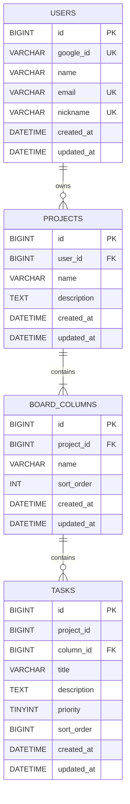

# ERD

문서 상태: 구현 계약 확정본  
DBMS: MySQL 8.0.46  
스키마 적용: 사용자가 MySQL Workbench에서 직접 실행

Redis Open Source 8.8은 Spring Session 인증 상태만 저장하며 RDB 도메인 ERD와 DDL에는 포함하지 않는다.

## 논리 ERD



## 물리 설계 결정

- 논리 엔티티 `User`의 물리 테이블은 MySQL 시스템 객체와 혼동을 피하기 위해 `users`로 명명한다.
- 주요 ID는 자동 증가 `BIGINT`다.
- 이름 중복과 제목 검색은 `utf8mb4_0900_ai_ci` collation으로 대소문자를 구분하지 않는다.
- `tasks(project_id, column_id)`가 동일한 `board_columns(project_id, id)`를 참조하도록 복합 외래키를 사용한다.
- `sort_order`는 서비스가 트랜잭션 안에서 재정렬한다. 조회 시 ID를 보조 정렬키로 사용한다.
- `ON DELETE CASCADE`는 사용자가 확인한 Project·BoardColumn 완전 삭제에만 사용한다.
- 애플리케이션 설정은 `spring.jpa.hibernate.ddl-auto=validate`다.

## 수동 적용 DDL

아래 DDL은 구현 시 엔티티와 함께 최종 대조해야 하는 기준안이다.

```sql
CREATE DATABASE IF NOT EXISTS ai_kanban
  CHARACTER SET utf8mb4
  COLLATE utf8mb4_0900_ai_ci;

USE ai_kanban;

CREATE TABLE users (
    id BIGINT NOT NULL AUTO_INCREMENT,
    google_id VARCHAR(255) NOT NULL,
    name VARCHAR(255) NOT NULL,
    email VARCHAR(320) NOT NULL,
    nickname VARCHAR(255) NOT NULL,
    created_at DATETIME(6) NOT NULL DEFAULT CURRENT_TIMESTAMP(6),
    updated_at DATETIME(6) NOT NULL DEFAULT CURRENT_TIMESTAMP(6)
        ON UPDATE CURRENT_TIMESTAMP(6),
    PRIMARY KEY (id),
    UNIQUE KEY uk_users_google_id (google_id),
    UNIQUE KEY uk_users_email (email),
    UNIQUE KEY uk_users_nickname (nickname)
) ENGINE=InnoDB;

CREATE TABLE projects (
    id BIGINT NOT NULL AUTO_INCREMENT,
    user_id BIGINT NOT NULL,
    name VARCHAR(100) NOT NULL,
    description TEXT NULL,
    created_at DATETIME(6) NOT NULL DEFAULT CURRENT_TIMESTAMP(6),
    updated_at DATETIME(6) NOT NULL DEFAULT CURRENT_TIMESTAMP(6)
        ON UPDATE CURRENT_TIMESTAMP(6),
    PRIMARY KEY (id),
    UNIQUE KEY uk_projects_user_name (user_id, name),
    KEY idx_projects_user_created (user_id, created_at, id),
    CONSTRAINT fk_projects_user
        FOREIGN KEY (user_id) REFERENCES users (id)
        ON DELETE RESTRICT
) ENGINE=InnoDB;

CREATE TABLE board_columns (
    id BIGINT NOT NULL AUTO_INCREMENT,
    project_id BIGINT NOT NULL,
    name VARCHAR(50) NOT NULL,
    sort_order INT NOT NULL,
    created_at DATETIME(6) NOT NULL DEFAULT CURRENT_TIMESTAMP(6),
    updated_at DATETIME(6) NOT NULL DEFAULT CURRENT_TIMESTAMP(6)
        ON UPDATE CURRENT_TIMESTAMP(6),
    PRIMARY KEY (id),
    UNIQUE KEY uk_board_columns_project_name (project_id, name),
    UNIQUE KEY uk_board_columns_project_id_id (project_id, id),
    KEY idx_board_columns_project_order (project_id, sort_order, id),
    CONSTRAINT fk_board_columns_project
        FOREIGN KEY (project_id) REFERENCES projects (id)
        ON DELETE CASCADE
) ENGINE=InnoDB;

CREATE TABLE tasks (
    id BIGINT NOT NULL AUTO_INCREMENT,
    project_id BIGINT NOT NULL,
    column_id BIGINT NOT NULL,
    title VARCHAR(200) NOT NULL,
    description TEXT NULL,
    priority TINYINT UNSIGNED NOT NULL,
    sort_order BIGINT NOT NULL,
    created_at DATETIME(6) NOT NULL DEFAULT CURRENT_TIMESTAMP(6),
    updated_at DATETIME(6) NOT NULL DEFAULT CURRENT_TIMESTAMP(6)
        ON UPDATE CURRENT_TIMESTAMP(6),
    PRIMARY KEY (id),
    KEY idx_tasks_column_order (column_id, sort_order, id),
    KEY idx_tasks_project_created (project_id, created_at, id),
    KEY idx_tasks_project_title (project_id, title),
    CONSTRAINT chk_tasks_priority CHECK (priority BETWEEN 1 AND 5),
    CONSTRAINT fk_tasks_project_column
        FOREIGN KEY (project_id, column_id)
        REFERENCES board_columns (project_id, id)
        ON DELETE CASCADE
) ENGINE=InnoDB;
```

## 삭제 결과

| 삭제 대상 | DB 결과 |
|---|---|
| User | MVP API에서 삭제하지 않음; DB FK는 Project가 있으면 삭제 거부 |
| Project | BoardColumn 삭제, 이어서 Task 삭제 |
| BoardColumn | 해당 열의 Task 삭제 |
| Task | 해당 Task만 삭제 |

## 인덱스와 쿼리 계약

- Project 목록 조회: `WHERE user_id = ? ORDER BY created_at DESC, id DESC`
- Board 조회: `board_columns ORDER BY sort_order, id`, 각 열의 `tasks ORDER BY sort_order, id`
- Items 조회·검색: 동일 그룹·카드 순서를 사용하며 `title LIKE` 조건만 추가
- Project 이름 중복: `(user_id, name)` 유일키
- BoardColumn 이름 중복: `(project_id, name)` 유일키
- 닉네임 중복: `nickname` 유일키

## 확정 범위 경계

- MVP 검색은 현재 `title LIKE`와 정의된 인덱스만 사용한다. 추가 검색 인덱스와 전문 검색 도입은 범위 밖이다.
- 백업·복구와 운영 스키마 배포 절차는 범위 밖이다.
- Redis 세션은 AOF/RDB 영속성을 요구하지 않아 Redis 재시작 후 유지가 보장되지 않으며, 세션이 사라졌으면 재로그인한다.

## 미확정 항목

없음.
